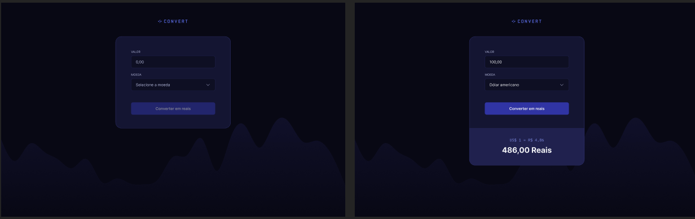

# 💱 Convert - Conversão de moedas

[]()
[]()
[]()

> Projeto prático da formação **FullStack** da [Rocketseat](https://www.rocketseat.com.br/).  
> Aplicativo de conversão de moedas estrangeiras para reais (BRL).

---

## 📸 Preview

  

---

## 📄 Sobre o projeto

O **Convert** é uma aplicação simples e intuitiva desenvolvida em JavaScript, que realiza a conversão de moedas estrangeiras para reais (BRL).
O foco do projeto está na lógica de conversão e manipulação de valores, sendo uma ótima prática de DOM, eventos e operações matemáticas em JavaScript.

**Funcionalidades:**

- Conversão de valores em diferentes moedas para reais (R$).
- Exibição automática do resultado formatado.
- Atualização dinâmica dos valores conforme a entrada do usuário.
- Interface leve e responsiva.
- Foco em interatividade e lógica, com o layout desenvolvido separadamente.

---

## 🛠 Tecnologias utilizadas

- **HTML5**  
- **CSS3**  
- **JavaScript**  

---

## 📂 Estrutura do projeto

```bash
Convert/
├── index.html         # Página principal
├── style.css          # Estilos da interface
├── script.js          # Lógica da conversão
└── assets/            # (opcional) imagens e ícones utilizados
```

```bash
git clone https://github.com/pollyana-valverde/Convert.git
```
```bash
cd Convert
```
---

👩‍💻 Autora

Feito por Pollyana Valverde
.
Projeto proposto pela Rocketseat
.

